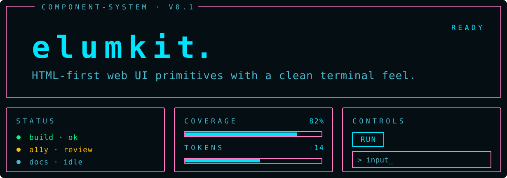

<p align="center">
  
</p>

<p align="center">
  <a href="https://github.com/baudsmithstudios/elumkit/releases"></a>
  <a href="LICENSE"></a>
  
  
  
</p>

## What It Does

ElumKit is a lean, terminal-inspired component system for modern web interfaces. It is intentionally plain-HTML first and distributed as source you copy into your project, commit, and modify directly. ElumKit pairs best with backend-heavy apps, internal tools, monitoring dashboards, and admin panels that need a dense, data-rich UI.

## Features

- **Terminal-inspired by default** — dense, calm, monospace-forward styling without retro CRT effects
- **HTML-first component contract** — semantic classes backed by CSS custom properties
- **Owned-source distribution** — copy the CSS primitives and markup patterns into your app
- **Framework-agnostic baseline** — usable from plain HTML, Eleventy, and server-rendered templates
- **No core JavaScript** — components rely on native HTML semantics; examples may use small demo scripts
- **Responsive interface patterns** — tables, toolbars, query rows, and dense panels adapt to narrow screens
- **Accessibility baseline** — keyboard-first patterns and WCAG 2.2 AA contrast targets

## Design Principles

- **Use native HTML first** — prefer real buttons, labels, fieldsets, tables, and form states before adding ARIA or JavaScript
- **Keep the CSS contract readable** — public classes and custom properties should be easy to inspect, copy, and override
- **Favor dense clarity** — terminal influence should improve scannability without novelty effects or decorative noise
- **Keep ownership clear** — copied source should stay readable, editable, and easy to audit

## Install From npm

Install ElumKit as a dev dependency:

```sh
npm install -D @baudsmithstudios/elumkit
```

Copy the CSS source into your app:

```sh
mkdir -p public/assets/elumkit
cp -R node_modules/@baudsmithstudios/elumkit/packages/core-css/src/* public/assets/elumkit/
```

Copy the HTML snippets as a local reference (optional):

```sh
cp node_modules/@baudsmithstudios/elumkit/packages/core-patterns/snippets/index.html ./elumkit-snippets.html

```
> [!IMPORTANT]
> Do not edit the files in `node_modules`. Copy them into your app, commit them, and modify the source directly.

## Manual Quick Start

Copy the core CSS source directory into your app while preserving its internal structure:

```text
packages/core-css/src/
```

For example:

```text
public/assets/elumkit/
  index.css
  tokens.css
  base.css
  components/
    button.css
    card.css
    data.css
    feedback.css
    form.css
    query.css
    tabs.css
    telemetry.css
    toolbar.css
```

Then link the copied CSS, set a theme on the document root, and use the semantic classes:

```html
<!doctype html>
<html data-theme="iron">
  <head>
    <link rel="stylesheet" href="/assets/elumkit/index.css" />
  </head>
  <body>
    <article class="elum-card elum-card-labeled">
      <header class="elum-card-header">
        <h2 class="elum-card-title">System</h2>
      </header>
      <p class="elum-card-subtitle">Current status</p>
      <button class="elum-button" type="button">Run</button>
    </article>
  </body>
</html>
```

Open `examples/playground.html` in a browser to see every component rendered together, or copy markup from `packages/core-patterns/snippets/index.html` into your own templates. Once copied, the CSS and markup belong to your application code.

## v0.1 Component Scope

Button, Input, Textarea, Checkbox, Radio Group, Select, Card, Alert, Badge, System Bar, Navigation Tabs, Toolbar, Query Row, Pagination, Empty State, Disclosure, Detail List, Status Label, Metrics, Meter, Data List, Data Table.

## Browser And Stability Notes

ElumKit targets modern evergreen browsers with support for CSS custom properties, `@import`, `:has()`, and standard form semantics.

v0.1 is an early-stage public release. The documented classes, data attributes, tokens, and markup patterns are the current contract, but they may change as the project evolves. Breaking changes are tracked in the changelog.

## Public Contract

- Documented `elum-*` classes are the reusable component surface.
- Documented `data-*` attributes are styling and state hooks.
- Theme tokens in `packages/core-css/src/tokens.css` are public customization points.
- Markup in `packages/core-patterns/snippets/index.html` is copyable source.
- Example-only classes in `examples/playground.html` are playground scaffolding, not component API.

## Documentation

- [Plain HTML quickstart](docs/plain-html-quickstart.md)
- [Eleventy usage](docs/eleventy-usage.md)
- [Component reference](docs/component-usage.md)
- [Theming](docs/theming.md)

## Project

- [Changelog](CHANGELOG.md)
- [Contributing](CONTRIBUTING.md)
- [Security policy](SECURITY.md)
- [License](LICENSE)

## Repository Layout

- `packages/core-css` — design tokens, base layer, and component styles
- `packages/core-patterns` — semantic HTML snippets for copy/paste usage
- `packages/core-js` — optional, framework-neutral progressive enhancement helpers
- `examples/playground.html` — every component rendered for visual review
- `docs/` — usage and theming guides
- `tests/` — Node test runner specs that pin the public contract

## License

ElumKit is released under the [MIT License](LICENSE).
