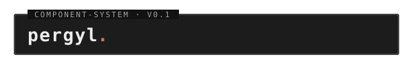

<p align="center">
  
</p>

<p align="center">
  
  
  
  
</p>

## What It Does

Pergyl is a lean, terminal-inspired component system for modern web interfaces. v0.1 is intentionally plain-HTML first, so you can use it directly in static sites and lightweight stacks and layer in framework adapters later.

## Features

- **Terminal-inspired by default** — dense, calm, monospace-forward styling without retro CRT effects
- **HTML-first component contract** — semantic classes backed by CSS custom properties
- **Framework-agnostic baseline** — usable from plain HTML, Eleventy, and server-rendered templates
- **Optional JavaScript only** — progressive enhancement where native HTML is not enough
- **Accessibility baseline** — keyboard-first patterns and WCAG 2.2 AA contrast targets

## What Pergyl Is Not

- **Not a retro skin pack** — no scanlines, pixel-art frames, or novelty CRT effects
- **Not framework-coupled** — no React/Vue lock-in at the core layer
- **Not an everything library** — v0.1 is a focused proof of concept

## Quick Start

Link the core CSS, set a theme on the document root, and use the semantic classes:

```html
<!doctype html>
<html data-theme="iron">
  <head>
    <link rel="stylesheet" href="path/to/pergyl/index.css" />
  </head>
  <body>
    <article class="pergyl-card pergyl-card-labeled">
      <header class="pergyl-card-header">
        <h2 class="pergyl-card-title">System</h2>
      </header>
      <p class="pergyl-card-subtitle">Current status</p>
      <button class="pergyl-button" type="button">Run</button>
    </article>
  </body>
</html>
```

Open `examples/playground.html` in a browser to see every component rendered together, or copy markup from `packages/core-patterns/snippets/index.html` into your own templates.

## v0.1 Component Scope

Button, Input, Textarea, Checkbox, Radio Group, Select, Card, Alert, Badge, System Bar, Status Label, Metrics, Meter, Data List, Data Table.

## Documentation

- [Plain HTML quickstart](docs/plain-html-quickstart.md)
- [Eleventy usage](docs/eleventy-usage.md)
- [Component reference](docs/component-usage.md)
- [Theming](docs/theming.md)

## Repository Layout

- `packages/core-css` — design tokens, base layer, and component styles
- `packages/core-patterns` — semantic HTML snippets for copy/paste usage
- `packages/core-js` — optional, framework-neutral progressive enhancement helpers
- `examples/playground.html` — every component rendered for visual review
- `docs/` — usage and theming guides
- `tests/` — Node test runner specs that pin the public contract

## Tech Stack

| Component | Library | Description |
|---|---|---|
| **Styling** | Plain CSS + custom properties | Token-driven theming; no preprocessor |
| **Tests** | [Node test runner](https://nodejs.org/api/test.html) | Built-in `node --test`; no test framework |
| **Examples** | Static HTML | Open in any browser; no build step |
