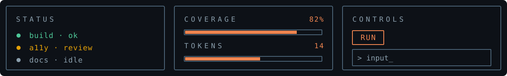
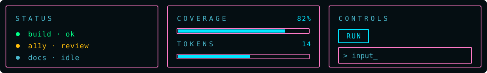
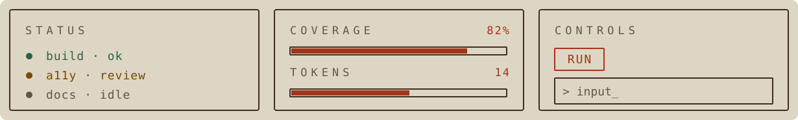

# Theming Guide (v0.1)

v0.1 theming is token-driven through CSS variables.

## Theme root

ElumKit ships with three built-in themes. Set the theme via `data-theme`:

```html
<html data-theme="iron">
```

Supported values:

- `iron` — the default; a serious dark palette for dense terminal-flavored interfaces

  

- `neon` — a synthwave-inspired dark palette with teal as the primary neon color and pink structural lines

  

- `dust` — a warm light palette with earthy tones and a brick red accent

  

`iron` is applied when no `data-theme` attribute is set.

Your project owns the source code, so you can always override the theme itself, or individual aspects (see below).

## Core token groups

Defined in `packages/core-css/src/tokens.css`:

- Color tokens (`--elum-color-*`)
- Typography tokens (`--elum-text-*`, `--elum-lh-*`, `--elum-font-family`)
- Spacing tokens (`--elum-space-*`)
- Layout tokens (`--elum-container-*`)
- Radius/border tokens (`--elum-radius-*`, `--elum-border-width`)
- Motion token (`--elum-motion-fast`)

## Color tokens

| Token | Role |
| --- | --- |
| `--elum-color-bg` | Page background |
| `--elum-color-surface` | Card and panel background |
| `--elum-color-fg` | Primary text |
| `--elum-color-muted` | De-emphasized text |
| `--elum-color-border` | Structural lines and dividers |
| `--elum-color-accent` | Interactive elements, primary buttons |
| `--elum-color-success` | Positive feedback states |
| `--elum-color-warn` | Caution states |
| `--elum-color-error` | Error and destructive states |
| `--elum-color-info` | Informational states |
| `--elum-color-focus` | Keyboard focus indicator |

`--elum-color-bg` and `--elum-color-surface` are separate tokens; the default themes assign them the same value for a flat, frameless look. You can override `--elum-color-surface` for additional card depth.

`--elum-color-muted` and `--elum-color-border` are distinct: muted is for de-emphasized text, border is for layout structure. `--elum-color-warn` and `--elum-color-error` are separate tokens from `--elum-color-accent`; the default themes assign them the same value, but they can be overridden independently.

## Layout tokens

| Token | Role |
| --- | --- |
| `--elum-container-width` | Max width of `.elum-container` page wrappers |
| `--elum-container-padding-inline` | Horizontal padding of `.elum-container` (responsive `clamp` by default) |
| `--elum-container-padding-block` | Vertical padding of `.elum-container` |

Layout tokens are intentionally independent of `--elum-space-*` so the page frame and component density can be retuned separately. Reference a spacing token in your override if you want them to track together.

Override these to set a project-wide page frame without modifying the `.elum-container` rule itself:

```css
:root {
  --elum-container-width: 64rem;
  --elum-container-padding-block: var(--elum-space-4);
}
```

## Override example

Override one or more tokens after loading ElumKit's CSS. For example, to swap the accent and focus ring to a different color:

```css
:root {
  --elum-color-accent: #5faf87;
  --elum-color-focus: #5faf87;
}
```

## Customization protocol

Load ElumKit first, then load application CSS after it. Override global tokens when the whole system should change, and override component custom properties when one component needs a supported adjustment.

```html
<link rel="stylesheet" href="/assets/elumkit/index.css" />
<link rel="stylesheet" href="./app.css" />
```

## Card custom properties

Card custom properties keep the default card behavior unless they are set globally or on a scoped parent.

```css
:root {
  --elum-card-title-size: var(--elum-text-md);
  --elum-card-title-color: #8b4a2a;
}

.status-card {
  --elum-card-padding: var(--elum-space-3);
  --elum-card-subtitle-color: var(--elum-color-fg);
  --elum-card-subtitle-size: var(--elum-text-sm);
}
```

Supported card properties:

- `--elum-card-padding`
- `--elum-card-label-bg`
- `--elum-card-title-color`
- `--elum-card-title-size`
- `--elum-card-subtitle-color`
- `--elum-card-subtitle-size`

## Component behavior notes

- Button primary variant uses `--elum-color-accent`.
- Invalid form states use `--elum-color-error`.
- Alert tones use `--elum-color-success`, `--elum-color-warn`, and `--elum-color-error`.
- Focus rings use `--elum-color-focus`, which each theme sets independently of the accent color.

## Reduced motion

Reduced motion is already implemented in `base.css` using `prefers-reduced-motion`.
